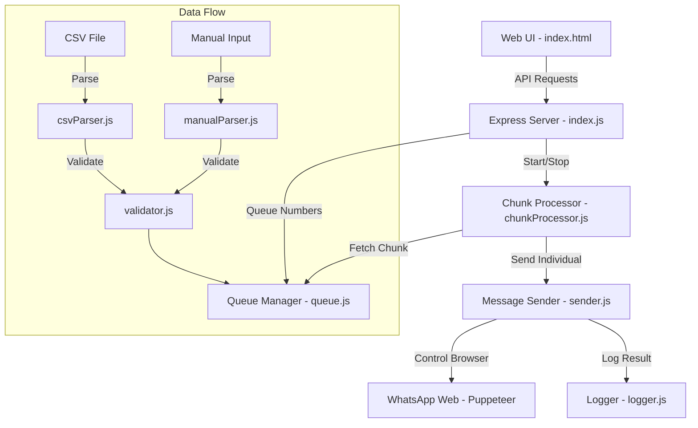

# 📚 WhatsApp Automation: Project Knowledge Base

## 🚀 Overview

This project is a Node.js-based automation tool designed to send personalized WhatsApp invitations to a list of phone numbers. It uses **Puppeteer** to control a browser and **Express** to provide a web-based control dashboard.

---

## 🏗 High-Level Architecture

---

## 🛠 Key Components

### 1. **Core Orchestration**

- **`index.js`**: The entry point. Sets up the Express server and defines API endpoints for uploading numbers, setting messages, and starting the automation.
- **`server/whatsapp.js`**: Manages the Puppeteer browser instance. Handles initialization, login checks (QR scan), and provides the shared browser page.

### 2. **Processing Engine**

- **`server/chunkProcessor.js`**: Controls the flow of sending. It breaks a large list into "chunks" and applies delays (`DELAY_BETWEEN_MESSAGES` and `DELAY_BETWEEN_CHUNKS`) to mimic human behavior and avoid WhatsApp bans.
- **`server/sender.js`**: The most critical module for reliability.
  - **Navigation Strategy**: Navigates to `about:blank` between every message to force a fresh reload of the WhatsApp SPA.
  - **Fallback Logic**: If the "Send" button icon doesn't load quickly, it uses a keyboard fallback (focus composer + press Enter).

### 3. **Data & Queue Management**

- **`server/queue.js`**: A singleton FIFO queue.
  - **Safety Check**: Prevents sending to the same number twice in one session (unless bypassed).
  - **Test Bypass**: Hardcoded list of test numbers that can be re-added infinitely for testing.
- **`server/validator.js`**: Normalizes all inputs into a standard format (`91XXXXXXXXXX`).

### 4. **Monitoring**

- **`server/logger.js`**: Saves every success/failure attempt into `logs/sent.json` with timestamps.
- **`public/index.html`**: A real-time dashboard to monitor pending vs. sent counts and view processing logs.

---

## 🛡 Robustness Features

- **Browser Isolation**: By moving to a blank page before each chat, we avoid the common issue where WhatsApp ignores URL parameter changes.
- **SSL Bypass**: The Puppeteer instance is configured with `ignoreHTTPSErrors: true` to prevent certificate-related crashes.
- **Memory Management**: The queue and logs can be cleared via the UI to reset the session without restarting the Node.js process.

---

## ⚙️ How to Work on This Project

1.  **Environment**: All critical settings (Delays, Port, Channel URL) are in the `.env` file.
2.  **Adding Features**:
    - To add a new parser, add it to `server/` and call it from `index.js`.
    - To change the UI, edit `public/index.html`.
3.  **Testing**: Use the `testNumbers` array in `queue.js` to add your own numbers for infinite testing.
